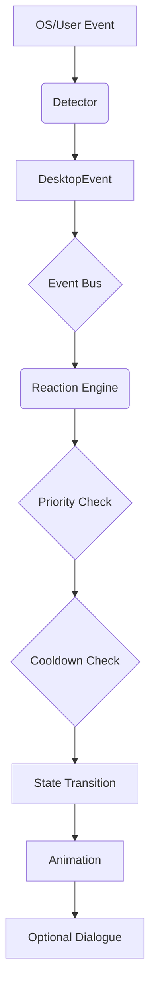

# Architecture

PixelPal follows an event-driven, local-first, modular architecture.

## Core Layers
1. **React UI**: Renders the character, speech bubbles, and user settings using React + Tailwind CSS.
2. **Tauri**: Provides the desktop shell (transparent window, always-on-top, system tray integration) and bridges the frontend to the Rust native layer.
3. **Rust Native Layer**: The core application backend executing locally on the user's machine.
4. **Windows-Specific Monitors**: OS-specific detectors (e.g., battery state, idle detection) that remain strictly isolated from the core logic.
5. **Common Event Model**: Standardized representation of OS events independent of the underlying platform.
6. **Event Bus**: The central pub/sub mechanism distributing events from monitors to the reaction engine.
7. **Reaction Engine**: Decides *what* should happen in response to an event, using Priority + Cooldown + State Machine logic.
8. **State Machine**: Manages the current status/emotion of the character (e.g., Idle -> Happy -> Sleepy).
9. **Animation Engine**: Determines *how* the reaction should look based on the selected response.
10. **Personality Engine**: Determines *how* the character should communicate.
11. **Permission Manager**: Controls what events are allowed to be monitored based on user consent.
12. **SQLite Persistence**: Local database storing character data, events, animations, and reactions.
13. **AI Character Generation**: (Future) An optional service layer for converting photos to pixel art.
14. **AI Conversation**: (Future) An optional service layer for intelligent dialogue.
15. **Optional Integrations**: (Future) Adapters for third-party services like Spotify, Discord, etc.

## Architectural Rules
- **Desktop engine before AI**: Core routines run locally and deterministically.
- OS monitoring must **NOT** know how the character looks.
- Character rendering must **NOT** know how Windows works.
- The **Event Engine** knows WHAT happened.
- The **Reaction Engine** decides WHAT SHOULD HAPPEN.
- The **Character/Animation Engine** decides HOW IT SHOULD LOOK.
- The **Personality Engine** decides HOW IT SHOULD COMMUNICATE.
- AI must NEVER have unrestricted control over the operating system.
- Shared event and reaction models must remain platform-independent.
- Future integrations must use adapters rather than being hardcoded into the core engine.

## Event Pipeline (Future Concept)


## Example Event Model
```json
{
  "type": "BATTERY_LOW",
  "timestamp": 1787832000,
  "metadata": {
    "battery_percent": 15
  }
}
```
